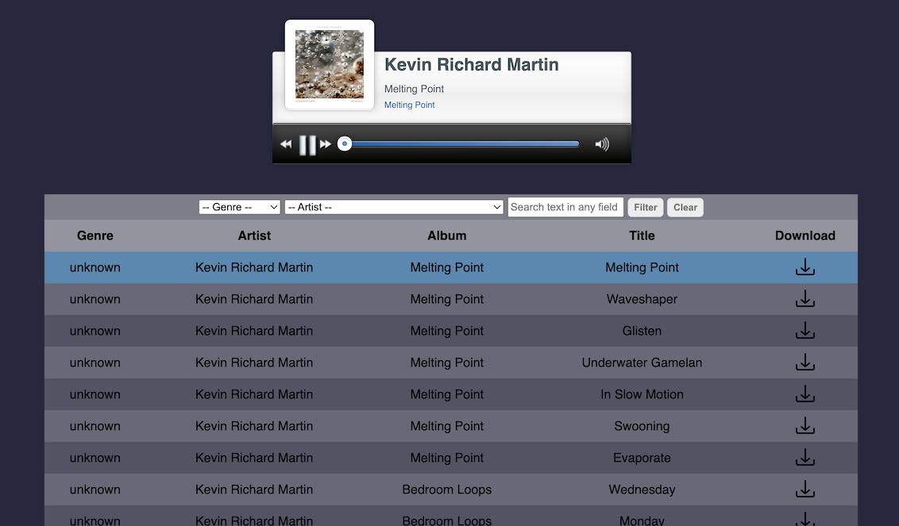

# Pungy
_A simple HTTP server and client for playing MP3 files from folders_

## Install

Python 3.10 is required. It is advised to create a virtual environment or using `pipx` to install pungy without intefering with the system python. In your virtual environment simply write:

```
pip install git+https://github.com/abul4fia/pungy.git
```

or, if you use `pipx`, no virtual environment is required:

```
pipx install git+https://github.com/abul4fia/pungy.git
```

## Run

Go to the folder in which is the music you want to serve, and run

```
pungy
```

Connect a browser to your IP, port 8000. That's all!



## Other options

You can specify the following options from command line:

* `--path` (or `-P`) to specify the absolute path to the folder in which the music is, if different from the current folder  
  This option allows to specify the path to a .m3u file, containing paths to mp3 and m4a files (relative to the folder in which the .m3u file is). In this case pungy does not crawl the folder, but reads the .m3u file to create the playlist.
* `--shuffle` (or `-s`) to shuffle the playlist (randomize the order of the songs). Without this option, the songs are played in the order in which they are found in the folder, or specified in the .m3u file.
* `--port` (or `-p`) to specify a port different from 8000


